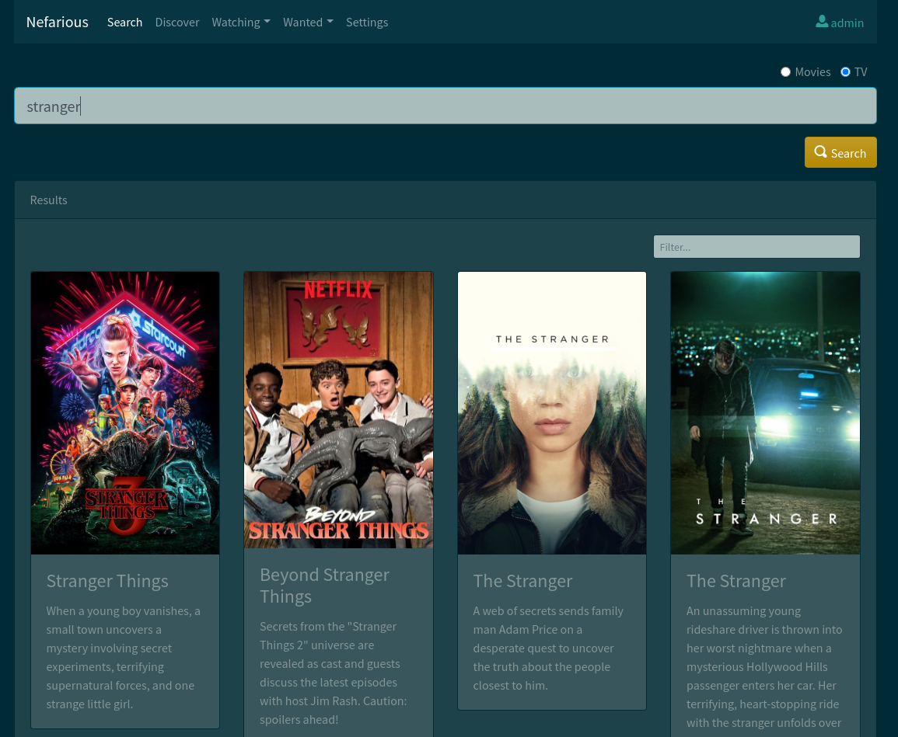
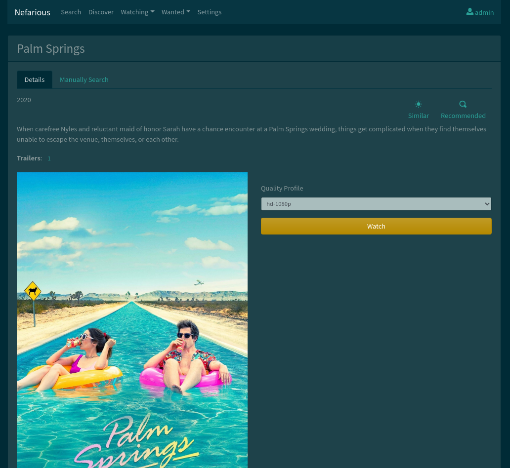
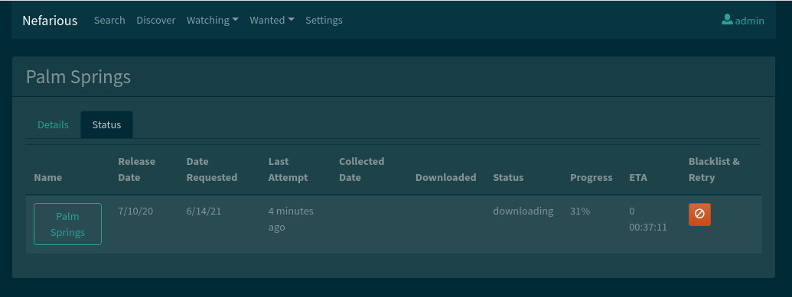
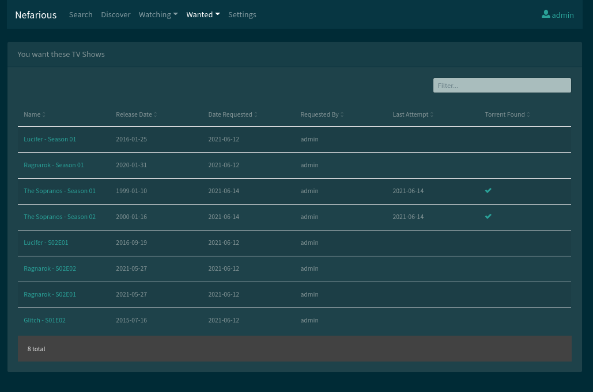
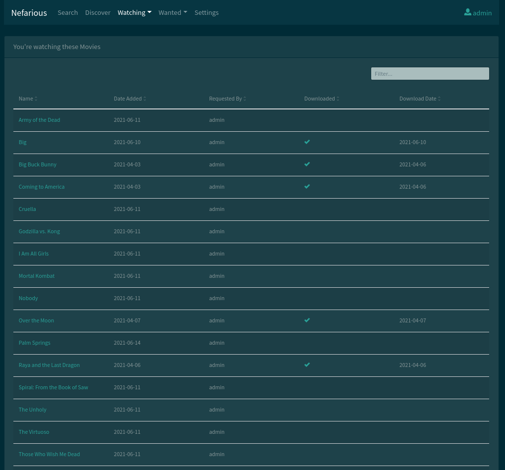
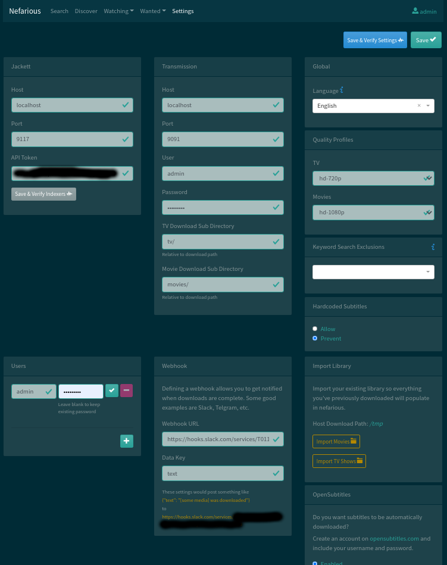

# nefarious

**nefarious is a web application that helps you download Movies and TV Shows.**

It aims to combine features of [Sonarr](https://github.com/Sonarr/Sonarr/), [Radarr](https://github.com/Radarr/Radarr) and [Ombi](https://github.com/tidusjar/Ombi).

It uses [Jackett](https://github.com/Jackett/Jackett/) and [Transmission](https://transmissionbt.com/) under the hood.  Jackett searches for torrents and Transmission does the downloading.

Features:
- [x] Search TV & Movies
- [x] Auto download TV (individual episodes or full season)
- [x] Auto download Movies
- [x] Discover TV & Movies (by popularity, genres, year etc)
- [x] Find similar TV & Movies
- [x] Find recommended TV & Movies
- [x] Manually search jackett's torrent results and download
- [x] Supports blacklisting torrent results (i.e avoid a bad/fake torrent that should be avoided)
- [X] Supports quality profiles (i.e only download *1080p* Movies and *any* quality TV)
- [x] Supports whether to download media with hardcoded subtitles or not
- [x] Supports user defined keywords to filter results (i.e ignore "x265", "hevc" codecs)
- [x] Auto download TV & Movies once it's released (routinely scan)
- [x] Monitor transmission results & status from within the app
- [x] Self/auto updating application
- [x] Supports multiple users and permission groups (i.e admin users and regular users)
- [x] Responsive Design (looks great on desktops, tablets and small devices like phones)
- [x] Movie trailers
- [x] Automatically renames media
- [x] Supports multiple languages (TMDB supports internationalized Titles, Descriptions and Poster artwork)
- [ ] Support user requests (i.e an unprivileged user must "request" to watch something)

### Contents

- [Demo](#demo)
- [Screenshots](#screenshots)
- [Dependencies](#dependencies)
- [Setup](#setup)
- [Troubleshooting](#troubleshooting)
- [Development](#development)

### Demo

### Screenshots

#### Login

#### Search

#### TV Result

#### Movie Result

#### Movie Custom Quality Profile

#### Download Status

#### Discover

#### Wanted

#### Watching

#### Settings

#### Search Manual

#### Mobile Friendly

### Dependencies

See [DEPENDENCIES.md](./DEPENDENCIES.md)

### Setup

#### Part 1 - Setup performed from terminal

Run the following commands:
    
    sudo systemctl start docker.service
    sudo systemctl enable docker.service
    sudo groupadd -f docker
    sudo usermod -aG docker $USER
    newgrp docker

This will:

- verify docker is initialized
- add current user to the docker group
- update the current shell session to use new login group

You'll now be able to run Docker commands without needing to call `sudo` each time.

Ensure that Docker is setup correctly.  Run the following command which should respond with "success":

    docker run --rm -it --init alpine echo "success"
    
Ensure that docker-compose is setup correctly.  This shows the version of docker-compose currently installed on the system:

    docker-compose --version
    
Clone the nefarious repository and start all the Docker containers:

    git clone https://github.com/lardbit/nefarious.git
    cd nefarious
    docker-compose up -d
    
**NOTE: the first time you bring up nefarious can take a few minutes.**

Your default local URLs for all the various services will be:

- nefarious: [http://localhost:8000](http://localhost:8000)
- Jackett: [http://localhost:9117](http://localhost:9117)
- Transmission: [http://localhost:9091](http://localhost:9091)

**NOTE:** See *Part 2* for finalizing the configuration.

##### ARM devices

For those running ARM devices like the raspberry pi, odroid, pine etc: 

You will need to reference the `docker-compose.arm.yml` file when running docker commands instead of the `docker-compose.yml` file.

For example, run the following to bring up all the services on ARM devices: 
    
    docker-compose -f docker-compose.arm.yml up -d

#### Part 2 - Setup performed from GUI or text editor

The default nefarious user/password is `admin`/`admin`.  On first login you will be directed to the main nefarious settings and asked to configure your Jackett API token.
Jackett's **host** in the main settings should remain `jackett` and the port should remain `9117`.  Copy your API Token from [Jackett](http://localhost:9117) into the appropriate nefarious section.
Don't forget to also add some indexers in Jackett to track your preferred content, and be sure to test them to see that they're working.  Some popular examples are *The Pirate Bay*, *1337x*, *RARBG*.

Transmission's host should remain `transmission` and port should remain `9091`.  It's possible to configure it with a username and password, but defaults to keeping them both blank.
Entering both username and password in the nefarious settings should only be done if the Transmission settings of 'transmission-settings.json' were also configured for your desired user/pass.
The Download Subdirectories can also be configured here as well.  Bear in mind these are subdirectories, and that we will be configuring the parent download directory shortly.
Leaving these as they are will be perfectly fine.  

Global Language, Keyword Exclusions, Subtitles, and Picture Quality can also be configured here.
TV and Movie quality profiles can be changed independently of each other if you wish to have differing profiles.
Finally, user accounts and passwords can be added or modified as well.  Feel free to change the defaults now if you so desire, or add additional users on your PC/system.
Once all of your Settings are to your preference, first click `Save` then be sure to `Verify Settings`.

##### Transmission Configuration

In order to change the download folder (which is set to `/tmp/transmission` by default) look for the `docker-compose.yml` file in your nefarious folder and edit 

    /tmp/transmission:/downloads

to be like

    /Your/Desired/Folder:/downloads
  
Leave the right side alone and only change the left side.  The structure of the folder path is the same for both Linux and Windows.
Once you've made your changes, save your `docker-compose.yml` file, open a terminal to your nefarious folder and type 

    docker-compose up -d

to update and apply your updates.

There is no default transmission user/pass, but feel free to edit the `transmission-settings.json` beforehand following the [official settings](https://github.com/transmission/transmission/wiki/Editing-Configuration-Files) to make any changes you'd like.

**NOTE** if you make any changes to `transmission-settings.json` you'll have to recreate the transmission container for the changes to take place:

    docker-compose up -d --force-recreate transmission

### Troubleshooting
   
    # logs for main app
    docker-compose logs -f nefarious

    # logs for tasks (search results)
    docker-compose logs -f celery

    # list all services (they should all be "up")
    docker-compose ps

    # use a hammer and restart everything (you won't lose your settings, though)
    docker-compose down
    docker-compose up -d

### Development

See [DEVELOPMENT.md](DEVELOPMENT.md).
