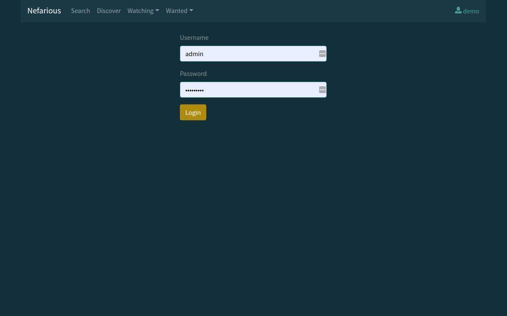
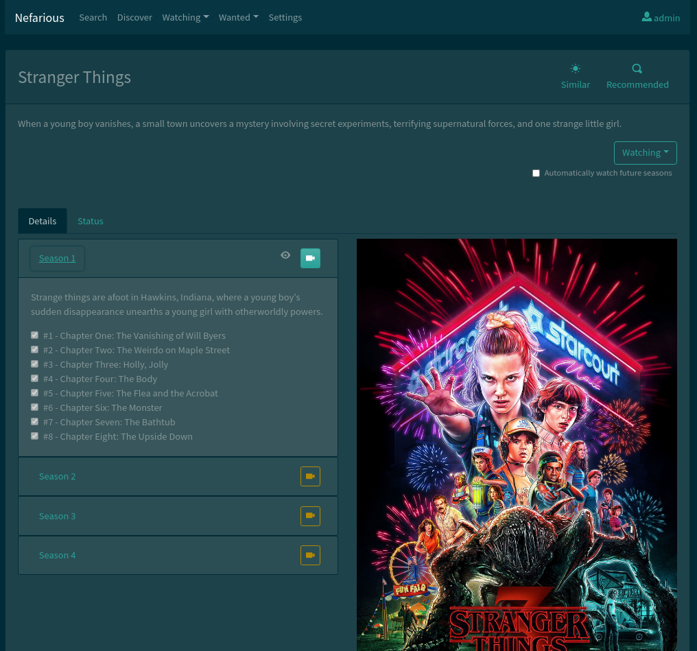
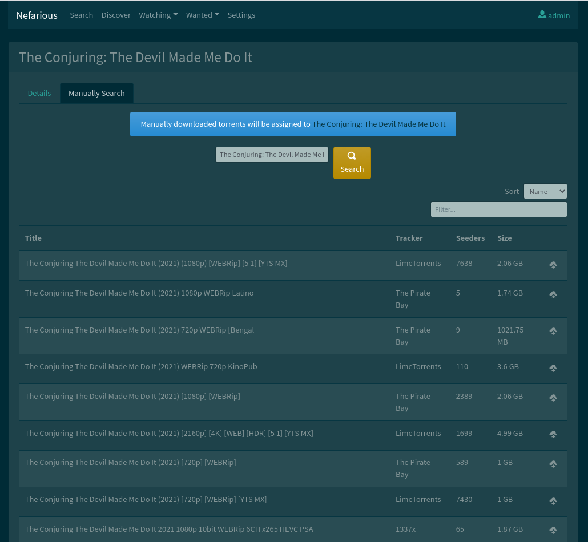
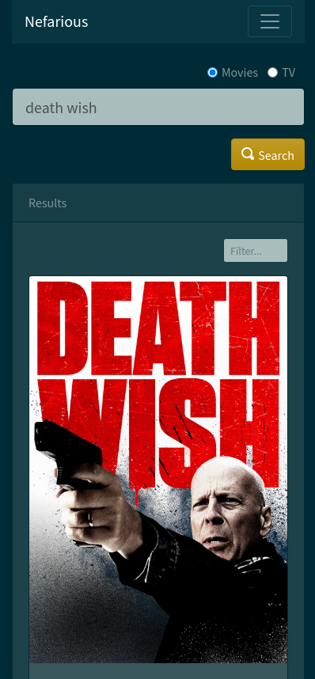

# nefarious

**nefarious is a web application that helps you download Movies and TV Shows.**

It aims to combine features of [Sonarr](https://github.com/Sonarr/Sonarr/), [Radarr](https://github.com/Radarr/Radarr) and [Ombi](https://github.com/tidusjar/Ombi).

It uses [Jackett](https://github.com/Jackett/Jackett/) and [Transmission](https://transmissionbt.com/) under the hood.  Jackett searches for torrents and Transmission does the downloading.

Features:
- [x] Search TV & Movies
- [x] Auto download TV (individual episodes or full season)
- [x] Auto download Movies
- [x] Discover TV & Movies (by popularity, genres, year etc)
- [x] Find similar TV & Movies
- [x] Find recommended TV & Movies
- [x] Manually search jackett's torrent results and download
- [x] Supports blacklisting torrent results (i.e avoid a bad/fake torrent that should be avoided)
- [X] Supports quality profiles (i.e only download *1080p* Movies and *any* quality TV)
- [x] Supports whether to download media with hardcoded subtitles or not
- [x] Supports user defined keywords to filter results (i.e ignore "x265", "hevc" codecs)
- [x] Auto download TV & Movies once it's released (routinely scan)
- [x] Monitor transmission results & status from within the app
- [x] Self/auto updating application
- [x] Supports multiple users and permission groups (i.e admin users and regular users)
- [x] Responsive Design (looks great on desktops, tablets and small devices like phones)
- [x] Movie trailers
- [x] Automatically renames media
- [x] Supports multiple languages (TMDB supports internationalized Titles, Descriptions and Poster artwork)
- [ ] Support user requests (i.e an unprivileged user must "request" to watch something)

### Contents

- [Demo](#demo)
- [Screenshots](#screenshots)
- [Dependencies](#Dependencies)
- [OS Agnostic Setup Guide](#OS Agnostic Setup Guide)
- [Troubleshooting](#troubleshooting)
- [Development](#development)

### Demo

### Screenshots

#### Login

#### Search

#### TV Result

#### Movie Result

#### Movie Custom Quality Profile

#### Download Status

#### Discover

#### Wanted

#### Watching

#### Settings

#### Search Manual

#### Mobile Friendly

### Dependencies

nefarious is best run via [Docker](https://hub.docker.com/search/?type=edition&offering=community) through [Docker Compose](https://docs.docker.com/compose/install/).

Install that and you're all set.  Check to see if your OS has Docker and Docker Compose repositories first before downloading from above.

### Arch based OSes can just install docker and docker-compose from Software Center/repositories

### Solus OS users can also simply install docker and docker-compose from Software Center

### Ubuntu/Debian x86-based OS Dependencies

Ensure that git and curl are already installed, then run the following commands:

    sudo apt install docker.io
    sudo curl -L https://github.com/docker/compose/releases/download/1.18.0/docker-compose-`uname -s`-`uname -m` -o         /usr/local/bin/docker-compose
    sudo chmod +x /usr/local/bin/docker-compose

You can update docker before or after the rest of the setup if you wish.

**NOTE:** For those running ARM-based Debian OSes

The commands from above should be identical, and the majority of commands below should match.  When you download nefarious from Github, you will run the 'docker-compose.arm.yml' file instead of the 'docker-compose.yml' file.  Like so: 
    
    docker-compose -f docker-compose.arm.yml up -d

### Fedora Dependencies

Install the Docker repository and update metadata cache

    sudo dnf config-manager --add-repo https://download.docker.com/linux/fedora/docker-ce.repo
    sudo dnf makecache

install docker and docker-compose from repository

    sudo dnf install docker-ce
    sudo dnf -y install docker-compose

At the moment Docker-Compose doesn't fully work without modification on Fedora 31.  30,29,28, and so on should work however.  If you're running Fedora 31, use the following Reddit Thread and most recent post at your own discretion. 
https://www.reddit.com/r/Fedora/comments/d8ukd0/has_anyone_managed_to_run_docker_ce_on_fedora_31/

### Windows OS Dependencies

You'll need to ensure that your PC is running a version of Windows 10 64-bit Professional, Education, or Enterprise.  Docker for Windows requires Hyper-V techonology, which is not supported by Windows 10 Home.  You'll also need to ensure that your PC has Virtualization enabled in BIOS before attempting to install Docker for Windows.  While Nefarious is not by any means a Linux exclusive application, it is much easier to setup on either a Linux based OS, or on a Linux Virtual Machine through your preferred VM software on any actively updated version of Windows. Consult appropriate documentation relating to said software if you wish to setup folder shares between your Linux VM and your Windows install.  Docker Toolbox is also an option, as it runs docker commands on non-Hyper-V supported OSes by running them through an integrated Linux VM.  If you'd prefer to avoid using something like Virtualbox, VMWare, or other separate Virtualization software, this would would probably work best for you.  That being said, we'd recommend this only be done by experienced users of Docker software.

### OS Agnostic Setup Guide

### Part 1 - Setup performed from terminal

    sudo systemctl start docker.service
    sudo systemctl enable docker.service
    sudo groupadd docker
   
If you get an error 'groupadd: group 'docker' already exists', proceed

    sudo usermod -aG docker $USER

The two above commands allow for Docker commands to be executed without needing to call for sudo each time you run any Docker command.  Logout, then login again.

    docker run --rm -it --init alpine echo "success"
    
Ensures that Docker is able to pull down container images, and will respond with "success" if it does so.

    docker-compose --version

This shows the version of docker-compose currently installed on the system

    git clone https://github.com/lardbit/nefarious.git
    cd nefarious
    docker-compose up -d redis jackett transmission   

Above commands construct the Docker containers for Jackett, Transmission Web GUI, and Redis

    docker-compose up -d

Run the above inside of your nefarious folder to locally update your containers.  Your default local addresses for the various services will be:

Nefarious local address     http://localhost:8000

Jackett local address       http://localhost:9117

Transmission local address  http://localhost:9091

### Part 2 - Setup performed from GUI or text editor

The default Nefarious user/password is admin/admin.  On first login you will be asked to configure your Jackett and Transmission settings.  Jackett's name in settings should remain 'jackett' and the port should remain 9117.  Copy your API Token from Jackett into the appropriate Nefarious section.  Don't forget to also add some indexers to track your preferred content, and be sure to test them to see that they're working!  

Transmission's port should remain 9091.  It also can be configured with a username and password, but feel free to leave both blank.  Entering both username and password in the UI should only be done if the Transmission settings of 'transmission-settings.json' were also configured for your desired user/pass.  The Download Subdirectories can also be configured here as well.  Bear in mind these are subdirectories, and that we will be configuring the parent download directory shortly.  Leaving these as they are will be perfectly fine.  

Global Language, Keyword Exclusions, Subtitles, and Picture Quality can also be configured here.  TV and Movie quality can be changed independently of each other if you wish to have differing profiles.  Finally, user accounts and passwords can be added or modified as well.  Feel free to change the defaults now if you so desire, or add additional users on your PC/system.  Once all of your Settings are to your preference, first click 'Save,' then be sure to Verify Settings.

### Transmission Configuration

In order to change the download folder (which is set to /tmp/transmission by default) look for the "docker-compose.yml" file in your nefarious folder and edit 

    /tmp/transmission:/downloads   

to be like    

    /Your/Desired/Folder:/downloads  
  
Leave the right side alone, only change the left side.  The structure of the folder path is the same for both Linux and Windows.  Once you've made your changes, save your docker-compose.yml file, open a terminal to your Nefarious folder and type 

    docker-compose up -d

to update and apply your newly created changes.  

There is no default transmission user/pass, but feel free to edit the `transmission-settings.json` beforehand following the [official settings](https://github.com/transmission/transmission/wiki/Editing-Configuration-Files) to make any changes you'd like.

**NOTE** if you make any changes to `transmission-settings.json` you'll have to recreate the transmission container for the changes to take place:

    docker-compose up -d --force-recreate transmission

## Troubleshooting
   
    # logs for main app
    docker-compose logs -f nefarious

    # logs for tasks (search results)
    docker-compose logs -f celery

    # list all services (they should all be "up")
    docker-compose ps

    # use hammer and restart everything (you won't lose your settings, though)
    docker-compose down
    docker-compose up -d

## Development

If you're interested in contributing or simply want to run nefarious without *docker* then follow these instructions.

nefarious is built on:

- Python 3.6
- Django 2
- Angular 6
- Bootstrap 4

*Note*: Review the `Dockerfile` for all necessary dependencies.

#### Install python dependencies

This assumes you're either installing these packages in your global python environment (in which case you probably need to use `sudo`) or, even better, install a [virtual environment](https://docs.python.org/3/library/venv.html) first.
  
    pip install -r src/requirements.txt

#### Build database
  
    python src/manage.py migrate

#### Run nefarious init script

This creates a default user and pass (admin/admin).

    python src/manage.py nefarious-init admin admin@localhost admin

#### Build front-end resources

First install the frontend dependencies:

    npm --prefix src/frontend install

Then build the frontend html/css stuff (angular):
    
    npm --prefix src/frontend run build
   
Note: run `npm --prefix src/frontend run watch` to automatically rebuild while you're developing the frontend stuff.
   
#### Run nefarious

Run the python application using django's *development* `runserver` management command: 

    DEBUG=1 python src/manage.py runserver 8000
   
It'll be now running at [http://127.0.0.1:8000](http://127.0.0.1:8000)

   
#### Run celery (task queue)

[Celery](http://celeryproject.org) is a task queue and is used by nefarious to queue downloads, monitor for things, etc.

Run the celery server:

    cd src
    celery -A nefarious worker --loglevel=INFO
    
You'll see all download logs/activity come out of here.

#### Dependencies

Jackett, Redis and Transmission are expected to be running somewhere.  

You can download and run them manually, or, for simplicity, I'd just run them via docker using the `docker-compose.yml` file.

Run redis, jackett and transmission from the `docker-compose.yml` file:

    docker-compose up -d redis jackett transmission
